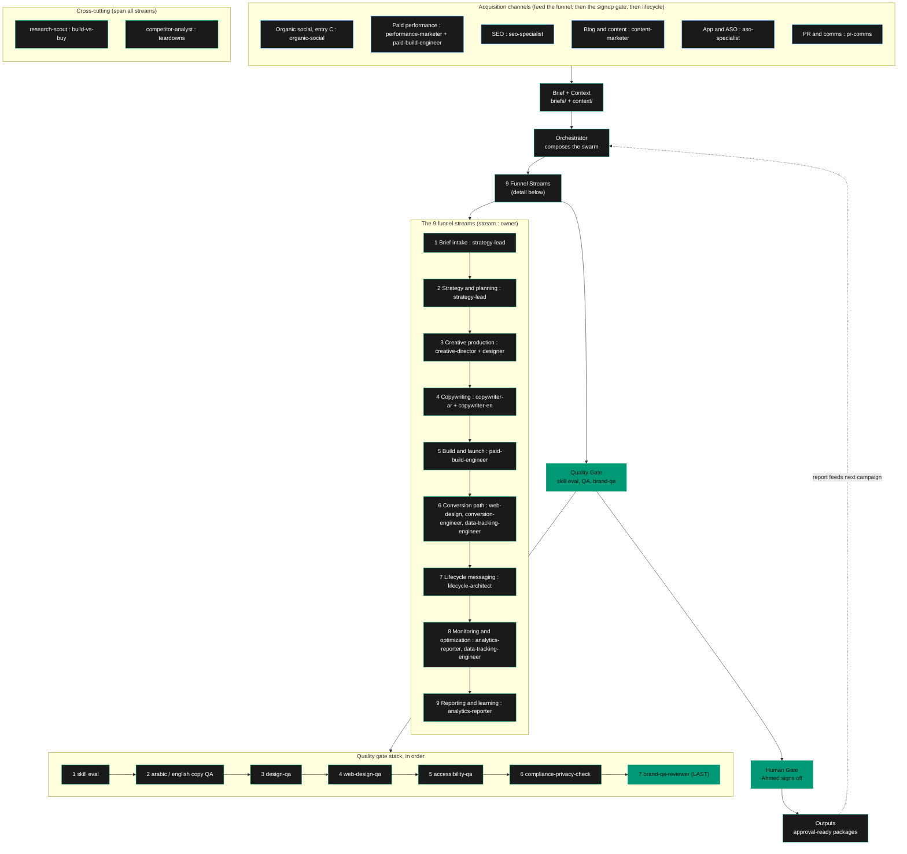
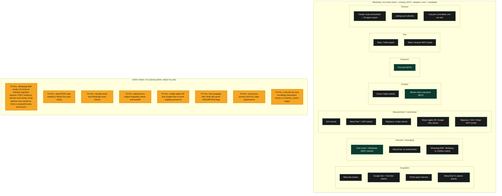

# Maharat Marketing Engine: engine and marketing stack map

A clear, comprehensible map of the engine and its marketing stack. Two diagrams: the engine
(run flow, the 9 funnel streams, acquisition channels, the two gates, cross-cutting roles) and
the marketing/tool stack with the open items that still need filling.

These are Mermaid diagrams. GitHub renders them on view, and Miro imports them directly (see
"Put this on Miro" at the end). Source of truth: `.claude/` on `main`. Generated 2026-06-10.

Legend: emerald = engine control or gate, dark card = agent or component, orange = open item
to fill, red = doc conflict to reconcile.

## 1. The engine

## 2. The marketing / tool stack, and the open items

## Open items, in plain text (so they are greppable)

1. TO FILL: the email platform is now named as Ortto in `context/04-tools-and-access.md` (the
   confirmed incumbent). Still open: the WhatsApp BSP vendor, whether to proceed with the team's
   Ortto-to-HubSpot migration (flagged for weak Arabic RTL), PDPL residency, and live send wiring.
2. TO FILL: Saudi PDPL data residency decision. Pending, and it blocks live send wiring.
3. TO FILL: expected monthly email and WhatsApp send volume.
4. TO FILL: owner of the ManyChat to engine integration, and how the handoff works.
5. TO FILL: mobile Apple IAP and Google Play to event mapping for the conversion path.
6. TO FILL: the first-campaign offer. A brief still carries ASSUMPTION flags.
7. TO FILL: tool access and approval process, and any GCC data requirements.
8. TO FILL: unify the two eval encodings (descriptive `checks` array vs the `machine_checks`
   regex layer that `scripts/eval_runner.py` runs, currently only in instructor-marketing packs).
9. RESOLVED in this change: SOP coverage. `context/03-workflow-map.md` now states that long-form
   SOPs exist for all 9 streams plus the 5 channels, matching `runtime/stream-ownership.md` and
   the 14 SOP files on disk.

## Put this on Miro

The Miro connector in this session is read-only (board create and item writes return HTTP 403),
so the board could not be created from here. Two ways to land it on Miro:

1. Native Mermaid import. In Miro, open the board, then use the Mermaid diagram option (the
   "Diagrams" or Mermaid app, or paste into a Mermaid code block) and paste either fenced block
   above. Miro renders it as editable shapes.
2. Enable write access. Grant the Miro connector edit scope (or connect a board you own with
   write access). Once write works, a single layout call rebuilds this as a native, brand-styled
   Miro board. The layout is already designed and ready to push.

## Provenance

Built from `.claude/CLAUDE.md`, `agents/_AGENTS-INDEX.md`, `runtime/SWARM.md`,
`runtime/stream-ownership.md`, `context/03-workflow-map.md`, `context/04-tools-and-access.md`,
and `.mcp.json`. No em dashes, Western numerals, empowering framing.
